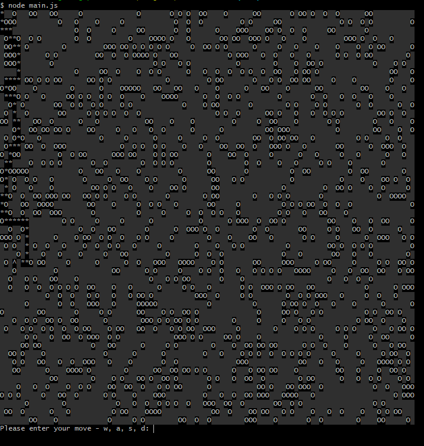
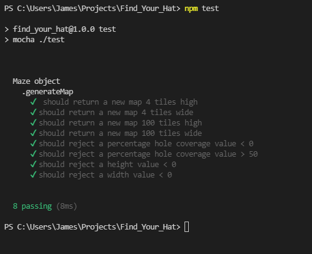

# Find Your Hat - terminal game

## Table of contents

- [Find Your Hat - terminal game](#find-your-hat---terminal-game)
  - [Table of contents](#table-of-contents)
  - [General info](#general-info)
  - [Technologies](#technologies)
  - [Tests](#tests)
  - [Setup](#setup)
  - [To-do list](#to-do-list)
  - [Status](#status)

## General info

This is simple terminal game where the objective is to navigate a maze and find the ^ symbol:

- hat = '^' // as explained above.
- hole = 'O' // avoid falling down holes or the game is over.
- fieldCharacter = '░' // navigable space.
- pathCharacter = '*' // represents path taken throughout the maze.

The maps are randomly generated via user input (mapHeight, mapWidth, percentageWholeCoverage) and are navigated using w, a, s, d. Maps are validated using a path finding algorithm which follows the steps listed below:

  1. Create a list of the four adjacent cells around the hat, with a counter variable of the current element's counter variable + 1 i.e
  hat location: [[3, 8, 0]] and adjacent cells [[ 2, 8, 1],[ 3, 7, 1],[ 4, 8, 1],[ 3, 9, 1]]
  2. Check all cells in the list for the following three conditions:
     1. If the position is a maze wall, remove it from the list
     2. if the position is a hole, remove it from the list
     3. If there is an element in the main list with the same coordinate, remove it from the cells list
  3. Add all remaining cells in the list to the end of the main list
  4. Go to the next item in the list and continue until hat is found or maxium number of possible moves is reached

If a map does not pass validation i.e. cannot be solved, a new map is generated.

## Technologies

- Javascript
- Node
- [prompt-sync](https://github.com/heapwolf/prompt-sync)

## Tests

A small test suit was added to the project at the time of creation using the Node assert libary and Mocha. Results can be seen below:

## Setup

`npm install prompt-sync`

## To-do list

- Update maze validator function to follow and print paths instead of entire list

## Status

Project is: _in progress_
